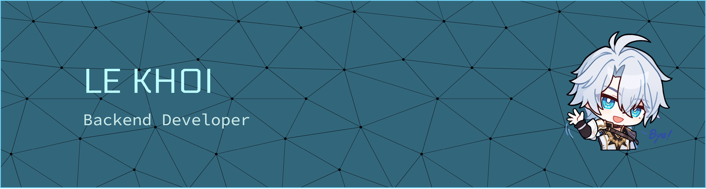

<!-- Banner -->

<h1 align="center">LE KHOI</h1>
<h3 align="center">Backend Developer</h3>

  I love creating <b>robust, scalable back-end systems</b> and clean, efficient APIs. 🖥️  
  Always eager to <b>explore new technologies</b> and deepen my understanding of how things work under the hood. 🔍

  

---

## 🧠 About Me

- 🌱 I'm currently learning: **Express, NestJS**
  
- 🎯 Goal: **Building impactful, real-world products**

- ⚡ Fun fact: **You can call me Kelvin**
  
- 🎮 Hobbies: **Gaming, Soccer, Music**

 

---

## 🛠 Tech Stack

<h3 align="center">Backend</h3>

  

<h3 align="center">Database</h3>

  
  

<h3 align="center">Tools</h3>

  

---

## 🚀 What I Can Do

- **Backend:** Design scalable RESTful APIs with **Node.js (NestJS/Express)**, focusing on clean architecture and performance.

- **Database:** Model efficient schemas with **MongoDB, SQL Server**.
  
- **Soft Skills:** Proactively learning, communicate clearly, manage tasks and collaborate effectively in team environments.

 

---

## 🌐 Connect with Me

  
  
  
  

  

---
